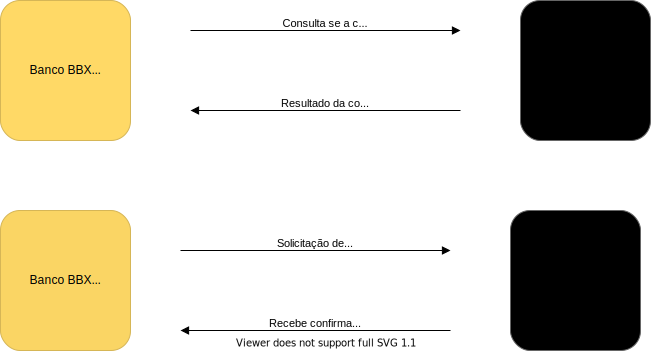

# CodePix

## Sobre o Projeto

 * É uma solução para simularmos transferências de valores entre bancos fictícios através de chaves (email, cpf).
 * Simularemos diversos bancos e contas bancárias que possuem uma chave Pix atribuída.
 * Cada conta bancária poderá realizar uma transferência para outra conta em outro banco utilizando a chave Pix da conta de destino.
 * Uma transação não pode ser perdida mesmo que: o CodePix esteja fora do ar.
 * Uma transação não pode ser perdida mesmo que: o Banco de destino esteja fora do ar.

 ## Sobre os Bancos
 
 * O banco será um microserviço com funções limitadas a cadastro de contas e chaves Pix, bem como transferência de valores.
 * Utilizaremos a mesma aplicação para simularmos diversos bancos, mudando apenas cores, nome e código.
 * Nest.js no backend.
 * Next.js como frontend.

 ## Sobre o CodePix

 * O microserviço CodePix será responsável por intermediar as transferências bancárias.
 * Receberá a transação de transferência.
 * Encaminhará a transação para o banco de destino (Status: "pending").
 * Recebe a confirmação do banco de destino (Status: "confirmed").
 * Envia a confirmação para o banco de origem informando quando o banco de destino processou.
 * Recebe a confirmação do banco de origem de que ele processou (Status: "completed").
 * Marca a transação como completa (Status: "completed").

 ## Cadastro e consulta de chave Pix

 * O Banco, para consultar uma chave Pix, irá consultar se a chave está cadastrada no CodePix.
 * O CodePix devolverá uma resposta informando se a chave está ou não cadastrada.
 * O Banco, para cadastrar uma chave Pix, irá solicitar a criação de uma chave no CodePix.
 * O CodePix devolverá uma resposta informando se a chave foi ou não cadastrada com sucesso.
 * Cada Banco terá as chaves geradas por eles mesmos em seu Banco de Dados.
 * O CodePix irá armazenar todas as chaves criadas.

 

 

## Dinâmica do processo

<ol>
  <li>Registra a transação.</li>
  <li>Muda o status para "confirmed".</li>
  <li>Informa banco de origem que a transação foi confirmada pelo banco de destino com status: "confirmed".</li>
  <li>Finaliza a transação mudando o status para "completed".</li>
</ol>

 

 

## Principais desafios

* Comunicação rápida e eficiente.
* Criação e consulta instantânea das chaves (Síncrona).
* Garantia de que nenhuma transação seja perdida, mesmo que qualquer dos 3 sistemas estejam fora do ar (Assíncrona).

 

<table>
  <tbody>
    <tr>
      <td>
        
      </td>
      <td>
      
      </td>
    </tr>
  </tbody>
</table>

## CodePix

* Será capaz de atuar como um servidor gRPC.
* Consumir e publicar mensagens no Apache Kafka.
* Ambas operações devem ser realizadas de forma simultânea ao executar o serviço.
* Trabalhar com um design focado em solucionar o problema do domínio.
* Deixar a complexidade técnica para "camada de aplicação", responsável pelo servidor gRPC e Kafka.
* Flexicível para a implementação de outros formatos de comunicação, como API Rest, CLI clients, etc. SEM alterar nenhum outro componente da aplicação ou modelo de domínio.

## Recursos a serem utilizados

* Docker
* Golang
* gRPC
* Apache Kafka
* PostgreSQL